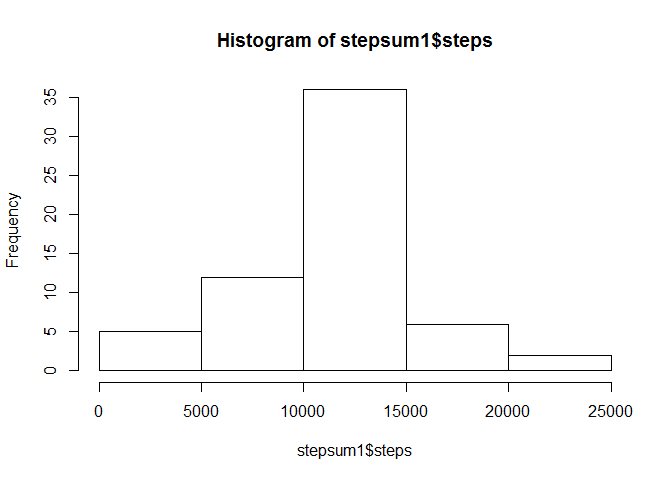

# Reproducible Research: Peer Assessment 1


## Loading and preprocessing the data
Set the working directory where the activity file is stored and read it

```r
setwd("C:/Users/s.maramreddy/OneDrive - Accenture/Personal/R/RepData_PeerAssessment1/activity")
activityfile <- read.csv("activity.csv")
```


## What is mean total number of steps taken per day?

```r
stepsum <- aggregate(steps~date, activityfile, sum)
hist(stepsum[,2])
```

<!-- -->

```r
mean(stepsum$steps)
```

```
## [1] 10766.19
```

```r
median(stepsum$steps)
```

```
## [1] 10765
```

## What is the average daily activity pattern?

```r
stepsInterval <- aggregate(steps ~ interval, activityfile, mean, na.rm = TRUE)
plot(steps ~ interval, data = stepsInterval, type = "l")
```

<!-- -->

```r
stepsInterval[which.max(stepsInterval$steps), ]$interval
```

```
## [1] 835
```


## Imputing missing values
Impute the missing values manually by calculating the mean of all the steps and then converting it to integer value


```r
missingval <- sum(!complete.cases(activityfile))
missingval
```

```
## [1] 2304
```

```r
newfile <- activityfile
newfile$steps[is.na(newfile$steps)] <- as.integer(mean(newfile$steps, na.rm = T))
stepsum1 <- aggregate(steps~date, newfile, sum)
hist(stepsum1$steps)
```

<!-- -->

```r
mean(stepsum1$steps)
```

```
## [1] 10751.74
```

```r
median(stepsum1$steps)
```

```
## [1] 10656
```

## Are there differences in activity patterns between weekdays and weekends?

```r
newfile$day = ifelse(as.POSIXlt(as.Date(newfile$date))$wday%%6 == 
    0, "weekend", "weekday")
# For Sunday and Saturday : weekend, Other days : weekday
newfile$day = factor(newfile$day, levels = c("weekday", "weekend"))
stepsInterval2 = aggregate(steps ~ interval + day, newfile, mean)

library(lattice)
xyplot(steps ~ interval | factor(day), data = stepsInterval2, aspect = 1/2, 
    type = "l")
```

<!-- -->
During the weekday, there are more steps between the intervls 500-1000 where as weekend has more steps between intervals of 1000 - 2000
